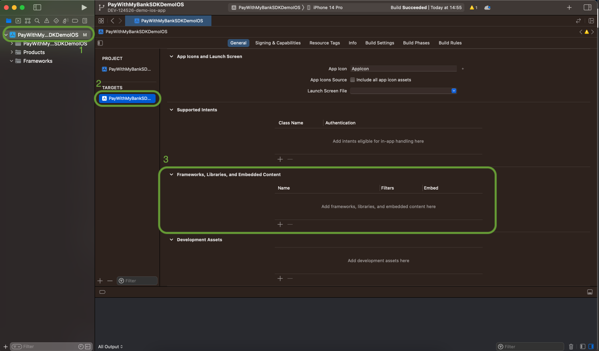
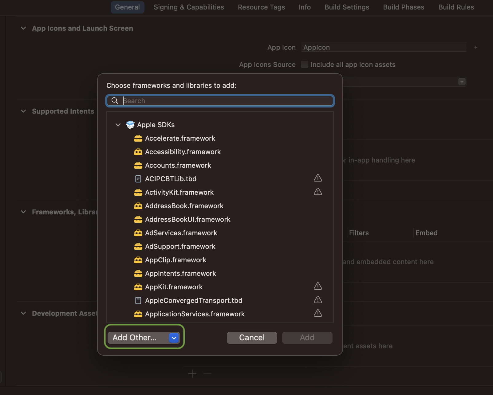
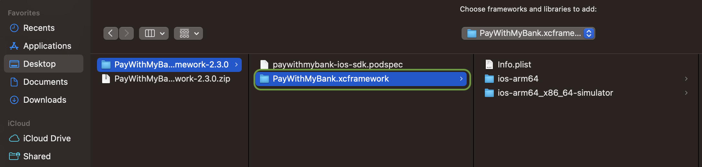
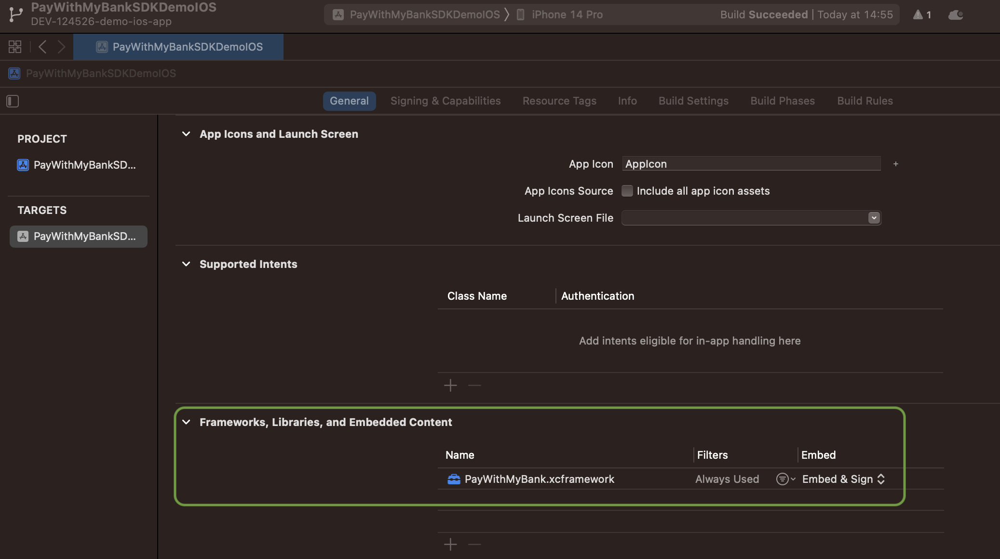

# About

This example app provides a simple integration of the Trustly Lightbox iOS SDK in a SwiftUI iOS app. 

## Getting Started

- Clone the project to your local environment
```
git clone git@github.com:TrustlyInc/trustly-ios-example.git
```
- With Xcode running, open the **PayWithMyBankSDKDemoIOS.xcodeproj** file inside this repository
- Download the latest version of the [PayWithMyBank iOS SDK](https://repo.paywithmybank.com/Specs/paywithmybank-ios-sdk/)
- Extract the downloaded files in your local environment
- From xCode:
    1. Select the project
    2. Select the target
    3. In the `Framework, Libraries, and Embedded Content` click in `+` button;
    

    4. In the pop-up window click in `Add Other...` drop down, and click in `Add files...`
    

    5. Go to the directory where you extracted the SDK from the downloaded file and select `PayWithMyBank.xcframework`
    

    6. If the framework appears in your project successfully, you are ready to build the app
    


# Implementation Notes

*****

In the `MerchantViewController` file, you will find a controller simulating the a merchant app screen. This controller will call the `TrustlyLightboxViewController` class, and this class will be responsible to call the `PayWithMyBank SDK`.

Note that the application has a URL Scheme configured in order for the app to have a Deep Link of `demoapp://`. A Deep Link is required for a successful Trustly Lightbox integration within a mobile app.


