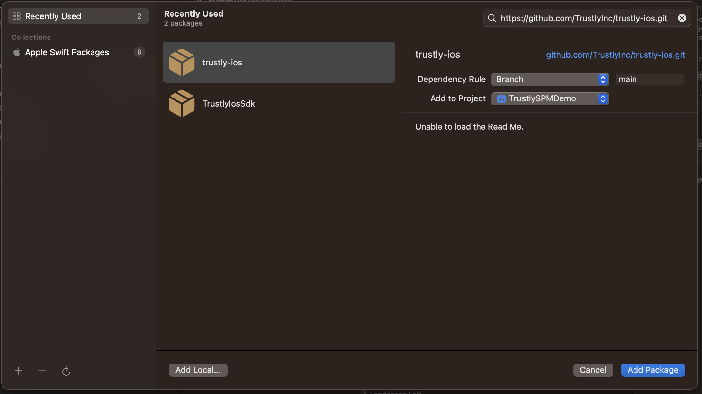

# About

This example app provides a simple integration of the Trustly Lightbox iOS SDK in a SwiftUI iOS app. 

## Getting Started

- clone
- open project
- Install Trustly SDK - This can be done 3 ways
    - Cocoapods
    - Swift Package Manager
    - Manually Download

<br />

<details>
<summary>Download and install manually</summary>
<br />
Clone the project to your local environment

```sh
git clone git@github.com:TrustlyInc/trustly-ios-example.git
````

- With Xcode running, open the **TrustlySDKDemoIOS.xcodeproj** file inside this repository
- Download the latest version of the [PayWithMyBank iOS SDK](https://repo.paywithmybank.com/Specs/paywithmybank-ios-sdk/)
- Extract the downloaded files in your local environment
- From xCode:
    1. Select the project
    2. Select the target
    3. In the `Framework, Libraries, and Embedded Content` click in `+` button;
    

    4. In the pop-up window click in `Add Other...` drop down, and click in `Add files...`
    

    5. Go to the directory where you extracted the SDK from the downloaded file and select `PayWithMyBank.xcframework`
    

    6. If the framework appears in your project successfully, you are ready to build the app
    

</details>

<details>
<summary>Cocoapods</summary>
<br />

TrustlySDK is available through [CocoaPods](https://cocoapods.org). To install
it, simply add the following line to your Podfile:

```ruby
pod 'TrustlySDK'
```

In order to develop or test against an unreleased version of this SDK it is possible to install the pod from a branch of this repo:
```ruby
pod 'TrustlySDK', :git => 'https://github.com/TrustlyInc/trustly-ios.git', :branch => '<BRANCH_NAME>'
```
</details>

<details>
<summary>Swift Package Manager - SPM</summary>
<br />

TrustlySDK is available through [Swift Package Manager](https://www.swift.org/package-manager/). To install it from Xcode simply click on File -> Add packages -> Search or Enter Package URL, paste the github url about this package `https://github.com/TrustlyInc/trustly-ios.git`:



For production choose the `main` branch, but in order to develop or test against an unreleased version of this SDK choose the branch listed in the [release version table](#versions).
</details>
<br />


# Implementation Notes

*****

In the `MerchantViewController` file, you will find a controller simulating the a merchant app screen. This controller will call the `TrustlyLightboxViewController` class, and this class will be responsible to call the `PayWithMyBank SDK`.

Note that the application has a URL Scheme configured in order for the app to have a Deep Link of `demoapp://`. A Deep Link is required for a successful Trustly Lightbox integration within a mobile app.


